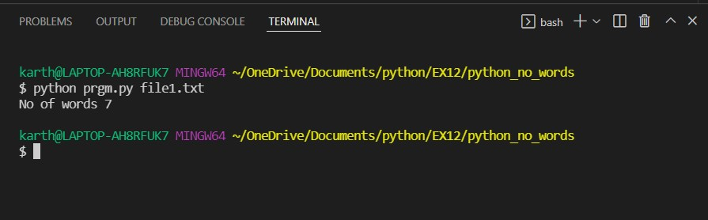

# command-line-arguments-to-count-word
## AIM:
To write a python program for getting the word count from the contents of a file using command line arguments.
## EQUIPEMENT'S REQUIRED: 
PC
Anaconda - Python 3.7
## ALGORITHM: 
### Step 1:
import sys
### Step 2: 
open file using open()
### Step 3: 
Read the file and save in variable
### Step 4:  
use for loop
### Step 5: 
use len to count number of words
### Step 6: 
display the value using print() function
## PROGRAM:
### PYTHON FILE:
```
import sys
fp = open(sys.argv[1]) 
data=fp.read()
word=data.split()
print("No of words",len(word))
```
### TEXT FILE:
```
Hello Good Morning 
Be a Good Daypython 

```
### OUTPUT:


## RESULT:
Thus the program is written to find the word count from the contents of a file using command line arguments.
